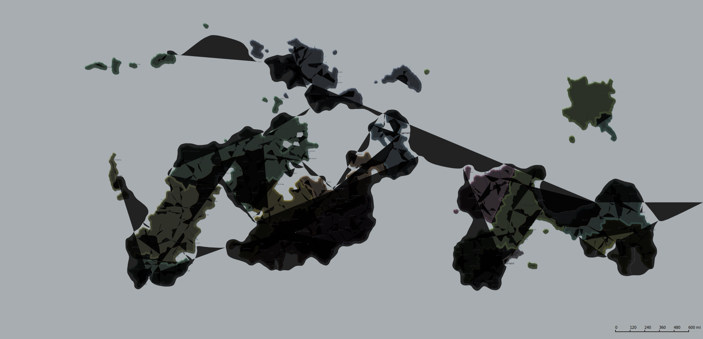

# Things

## .map format

### Lines

- 1: Info field in json, but without keys and separated with | symbol
- 2: Settings field in json, but without keys and separated with | symbol
- 3: Map winds field in json in json format
- 4: Biomes data, separated with | symbol
  - 4.1: Color field
  - 4.2: Habitability field
  - 4.3: Name field
- 5: Settings field in json, as list
- 6~139: wierd looking svg 
- 140:
